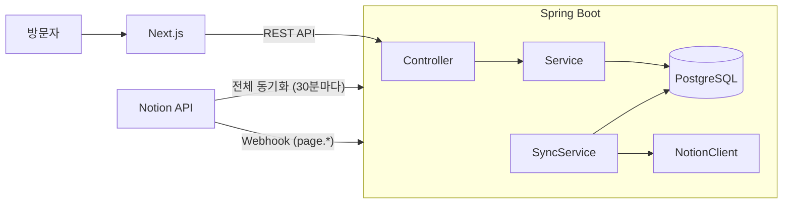

# Notion Folio PRD

> Notion을 CMS로 쓰고, **Spring Boot API 서버**가 콘텐츠를 동기화해서 제공하는 백엔드 개발자 포트폴리오

## 프로젝트 개요

- **프로젝트명**: Notion Folio (가칭)
- **목적**: Notion을 CMS로 써서 백엔드 개발자 포트폴리오를 운영한다. 사이트 자체도 백엔드 역량을 보여주는 프로젝트로 만든다
- **CMS 선택 이유**: Notion API를 쓰면 코드를 고치거나 다시 배포하지 않아도 콘텐츠를 관리할 수 있다. 비개발자도 쓸 수 있다
- **아키텍처 핵심**: 프론트엔드가 Notion을 직접 부르지 않는다. Spring Boot가 Notion 콘텐츠를 PostgreSQL로 **동기화**하고, 정제된 REST API로 제공한다
- **이 구조를 고른 이유**: Notion을 그대로 CMS로 쓸 때 생기는 문제는 모두 백엔드가 풀어야 하는 문제다. 아래 표의 문제를 이 프로젝트에서 직접 설계하고 해결한다

| Notion 직접 호출 시 문제 | 이 프로젝트의 해결 방식 |
|---|---|
| 초당 평균 3회 rate limit | 조회는 DB에서만 처리해서 방문자 트래픽이 Notion 호출로 이어지지 않는다. 동기화 호출은 재시도와 백오프로 처리한다 |
| Notion 파일 URL이 1시간 뒤 만료 | 이미지 프록시 API가 만료 전에 URL을 다시 받아온다 |
| 수정 사항 반영 지연 | Notion Webhook으로 변경된 페이지만 증분 동기화한다 |
| Notion 응답 구조가 복잡하고 중첩이 깊음 | 도메인 모델과 응답 DTO로 변환해서 단순한 API를 제공한다 |
| Notion 장애가 곧 사이트 장애 | DB에 마지막 동기화 상태가 남아 있어서 Notion이 멈춰도 사이트는 계속 동작한다 |

- **대상 사용자**
  - 방문자: 채용 담당자, 기술 면접관. 프로젝트의 문제 해결 과정과 수치 성과를 보고 싶어 한다
  - 운영자(본인): Notion에서만 콘텐츠를 관리하고 싶어 한다

## 주요 기능

1. **Notion 동기화 엔진**
   - 주기적 전체 동기화(`@Scheduled`)와 Webhook 기반 증분 동기화를 둘 다 지원한다
   - `notion_page_id` 기준으로 upsert하므로 같은 동기화를 여러 번 돌려도 결과가 같다(멱등)
   - `Published`가 아니게 바뀌거나 Notion에서 삭제된 페이지는 숨김 처리한다
   - 실행할 때마다 동기화 이력(시작, 종료, 결과, 처리 건수, 실패 사유)을 남긴다
2. **포트폴리오 REST API**
   - 프로젝트 목록(카테고리·기술스택 필터, 페이지네이션), 프로젝트 상세, 프로필, 필터 옵션 API를 제공한다
   - 모든 응답은 `ApiResponse<T>` 형식이고, API 문서는 Swagger로 제공한다
3. **Notion 블록 → Markdown 변환기**
   - 동기화 시점에 페이지 본문 블록을 Markdown으로 변환해서 DB에 저장한다
   - 프론트는 받은 Markdown을 렌더링만 한다
4. **이미지 프록시**
   - 이미지는 Notion 원본 URL 대신 `/api/images/{id}`로 제공한다
   - URL이 만료됐으면 Notion에서 새로 받아 302로 리다이렉트한다
5. **Next.js 프론트엔드**
   - Spring API를 호출해서 홈, 목록, 상세, About 화면을 렌더링한다(ISR)

## 기술 스택

### Backend (핵심)

| 구분 | 기술 | 비고 |
|---|---|---|
| Language / Framework | Java 25, Spring Boot 4.1.1 | invoice-web 스타터 킷 구조를 재사용한다 |
| Notion 연동 | Spring `RestClient` | 공식 Java SDK가 없어서 직접 구현한다. `Notion-Version` 헤더는 설정값으로 둔다 |
| DB / 마이그레이션 | PostgreSQL 18, Flyway | `ddl-auto: validate` |
| ORM | Spring Data JPA (Hibernate 7) | 필터 조회는 `Specification`으로 한다 |
| 매핑 | MapStruct | 엔티티 → 응답 DTO 단방향 |
| 스케줄링 / 비동기 | `@Scheduled`, `@Async` (Virtual Thread) | 전체 동기화와 Webhook 후처리에 쓴다 |
| API 문서 | springdoc-openapi | `/swagger-ui.html` |
| 테스트 | JUnit 5, Testcontainers, `MockRestServiceServer` | Notion API는 목으로 대체한다 |
| 운영 | Spring Boot Actuator, Docker | 헬스체크와 동기화 메트릭을 노출한다 |

### Frontend (얇게 유지)

| 구분 | 기술 |
|---|---|
| Framework | Next.js 15 (App Router), TypeScript |
| Styling | Tailwind CSS, `@tailwindcss/typography`, shadcn/ui |
| 본문 렌더링 | `react-markdown` |
| Icons | Lucide React |

### 배포

- Backend와 PostgreSQL: Docker 이미지로 배포한다. 대상은 Railway, Fly.io, AWS 중에서 고른다 `[오픈 이슈]`
- Frontend: Vercel

## 시스템 아키텍처



**패키지 구조** (스타터 킷의 `global/` + `domain/` 규칙을 따른다)

```
global/
├─ notion/          NotionClient(RestClient), Notion 응답 DTO, 재시도 정책, NotionProperties
└─ markdown/        BlockToMarkdownConverter
domain/
├─ project/         프로젝트 조회 API (controller / service / repository / entity / dto / mapper)
├─ profile/         About 조회 API
├─ image/           이미지 프록시
└─ sync/            동기화 서비스, 스케줄러, Webhook 수신, 동기화 이력
```

## Notion 데이터베이스 구조

### Projects (데이터베이스)

| 속성 | Notion 타입 | 필수 | 설명 |
|---|---|---|---|
| Title | `title` | O | 프로젝트명 |
| Slug | `rich_text` | O | URL 경로. 영문 소문자와 하이픈만 쓴다. 유일해야 한다 |
| Summary | `rich_text` | O | 카드에 들어갈 한 줄 소개 |
| Category | `select` | O | Backend / Infra / Data / Side |
| Language | `multi_select` | O | Java, Kotlin, Go 등 |
| Framework | `multi_select` | - | Spring Boot, JPA 등 |
| Database | `multi_select` | - | PostgreSQL, Redis, Kafka 등 |
| Infra | `multi_select` | - | AWS, Docker, Kubernetes 등 |
| Period | `date` (range) | O | 진행 기간 |
| Role | `rich_text` | O | 담당 역할과 기여도 |
| Problem | `rich_text` | O | 해결하려던 문제 |
| Solution | `rich_text` | O | 해결 방식 요약 |
| Metrics | `rich_text` | - | 수치로 된 성과. 예: "p95 800ms → 120ms", "월 인프라 비용 40% 절감" |
| Architecture | `files` | - | 시스템 구성도 이미지 |
| GithubUrl | `url` | - | 저장소 링크 |
| ApiDocsUrl | `url` | - | Swagger 등 API 문서 링크 |
| Featured | `checkbox` | - | 체크하면 홈에 노출 |
| Status | `select` | O | Draft / Published |
| Order | `number` | - | 정렬 순서 |
| (페이지 본문) | blocks | - | 상세 설명: 배경, 설계, 트러블슈팅, 회고 |

필수 속성이 빠진 페이지는 동기화할 때 건너뛴다. 어떤 페이지를 왜 건너뛰었는지는 동기화 이력에 남긴다.

### About (일반 페이지)

Notion 페이지 하나로 관리한다. 본문을 Markdown으로 변환해서 `profile` 테이블에 저장한다.

### 로컬 DB 스키마 (Flyway)

| 마이그레이션 | 테이블 | 주요 컬럼 |
|---|---|---|
| `V1__create_project.sql` | `project` | id, notion_page_id(UNIQUE), slug(UNIQUE), title, summary, category, role, problem, solution, metrics, period_start, period_end, content_markdown, featured, sort_order, visible, notion_last_edited_at, synced_at |
| `V2__create_project_tech.sql` | `project_tech` | project_id, type(LANGUAGE/FRAMEWORK/DATABASE/INFRA), name. 인덱스는 (type, name) |
| `V3__create_profile.sql` | `profile` | id, notion_page_id, content_markdown, synced_at |
| `V4__create_image_asset.sql` | `image_asset` | id, notion_source_id(블록 ID 또는 페이지 ID + 속성명), cached_url, expires_at |
| `V5__create_sync_history.sql` | `sync_history` | id, trigger(SCHEDULED/WEBHOOK/MANUAL), status, started_at, finished_at, upserted, hidden, skipped, error_message |
| `V6__create_webhook_event.sql` | `webhook_event` | event_id(PK), received_at. 중복 이벤트를 걸러내는 데 쓴다 |

### 환경변수

```
NOTION_TOKEN=secret_xxx
NOTION_VERSION=2026-03-11                 # 구현 시점에 최신 버전 재확인
NOTION_PROJECTS_DATA_SOURCE_ID=xxx        # database ID가 아니라 data source ID
NOTION_ABOUT_PAGE_ID=xxx
NOTION_WEBHOOK_VERIFICATION_TOKEN=xxx
ADMIN_API_KEY=xxx                         # 수동 동기화 API 보호용
```

## API 명세

| Method | Path | 설명 | 응답 |
|---|---|---|---|
| GET | `/api/projects?category=&tech=&page=&size=` | 공개된 프로젝트 목록 (Order 오름차순 → 기간 최신순) | `ApiResponse<Page<ProjectSummaryResponse>>` |
| GET | `/api/projects/featured` | 홈에 노출할 프로젝트 | `ApiResponse<List<ProjectSummaryResponse>>` |
| GET | `/api/projects/{slug}` | 프로젝트 상세 (Markdown 본문 포함) | `ApiResponse<ProjectDetailResponse>` |
| GET | `/api/tech-stacks` | 필터 옵션 (타입별 기술 목록과 사용 횟수) | `ApiResponse<List<TechStackResponse>>` |
| GET | `/api/profile` | About | `ApiResponse<ProfileResponse>` |
| GET | `/api/images/{id}` | 이미지 프록시 | `302 Found` (Location: 유효한 Notion URL) |
| POST | `/api/webhooks/notion` | Notion Webhook 수신 | `200 OK` |
| POST | `/api/admin/sync` | 수동 전체 동기화 (`X-Admin-Key` 헤더 필요) | `ApiResponse<SyncResultResponse>` |
| GET | `/api/admin/sync/history` | 동기화 이력 조회 (`X-Admin-Key` 헤더 필요) | `ApiResponse<List<SyncHistoryResponse>>` |

**응답 예시** (`GET /api/projects/order-system`)

```json
{
  "success": true,
  "data": {
    "slug": "order-system",
    "title": "주문 처리 시스템 개선",
    "summary": "동기 호출 체인을 이벤트 기반으로 전환",
    "category": "BACKEND",
    "period": { "start": "2025-03-01", "end": "2025-08-31" },
    "role": "백엔드 리드 (기여도 70%)",
    "problem": "피크 시간 주문 API 타임아웃",
    "solution": "Kafka 기반 비동기 처리 + Outbox 패턴",
    "metrics": "p95 800ms → 120ms",
    "techStack": { "language": ["Java"], "framework": ["Spring Boot"], "database": ["PostgreSQL", "Kafka"], "infra": ["AWS"] },
    "architectureImageUrl": "/api/images/42",
    "links": { "github": "https://github.com/...", "apiDocs": null },
    "contentMarkdown": "## 배경\n...",
    "syncedAt": "2026-09-24T10:30:00+09:00"
  },
  "error": null
}
```

**ErrorCode 추가 목록**

| ErrorCode | HTTP | 상황 |
|---|---|---|
| `PROJECT_NOT_FOUND` | 404 | 없는 slug이거나 공개되지 않은 프로젝트 |
| `PROFILE_NOT_FOUND` | 404 | 아직 About을 동기화하지 않았다 |
| `IMAGE_NOT_FOUND` | 404 | 없는 이미지 ID |
| `NOTION_UNAVAILABLE` | 502 | Notion API 장애 (이미지 URL을 새로 받을 때 등) |
| `NOTION_RATE_LIMITED` | 503 | 재시도해도 계속 429가 온다 |
| `INVALID_WEBHOOK_SIGNATURE` | 401 | Webhook 서명 검증 실패 |
| `INVALID_ADMIN_KEY` | 401 | 관리자 키가 없거나 틀리다 |
| `SYNC_ALREADY_RUNNING` | 409 | 동기화가 이미 실행 중이다 |

## 동기화 상세 설계

**전체 동기화** (30분마다 + 수동 실행)
1. `dataSources.query`에 `Status = Published` 조건을 걸어 조회한다. `has_more`/`next_cursor`로 페이지네이션한다
2. 각 페이지의 `last_edited_time`을 DB의 `notion_last_edited_at`과 비교한다. 바뀐 페이지만 본문 블록을 조회한다. 이렇게 하면 Notion 호출 수가 크게 줄어든다
3. 블록을 Markdown으로 변환한다. 자식 블록(토글, 리스트 중첩)은 재귀로 조회한다
4. 페이지 단위 트랜잭션으로 upsert한다. 한 페이지가 실패해도 나머지는 계속 진행한다
5. 조회 결과에 없는 기존 프로젝트는 `visible = false`로 바꾼다
6. `sync_history`에 결과를 기록한다
7. 동시 실행은 막는다. 이미 실행 중이면 `SYNC_ALREADY_RUNNING`을 반환한다

**Webhook 증분 동기화**
1. raw body를 기준으로 `X-Notion-Signature`(HMAC-SHA256)를 검증한다. JSON을 파싱한 뒤 다시 직렬화하면 바이트가 바뀌어서 서명이 깨지니까 원본 문자열로 검증해야 한다
2. `webhook_event`에 이벤트 ID가 이미 있으면 무시한다. Notion이 재전송할 수 있어서 필요하다
3. 곧바로 200을 응답한다. 실제 동기화는 `@Async`로 해당 페이지 하나만 처리한다
4. 대상 이벤트: `page.content_updated`, `page.properties_updated`, `page.deleted` 등 `[확인 필요: 구독할 이벤트 목록 확정]`

**Notion 호출 정책**
- 429나 529가 오면 `Retry-After`(초)만큼 기다렸다가 다시 시도한다. 헤더가 없으면 지수 백오프(최대 30초)에 jitter를 더한다. 최대 6번까지 시도한다
- GET 요청은 500/502/503/504가 와도 같은 방식으로 재시도한다
- 동기화 중에는 요청을 순차로 보내서 초당 3회를 넘지 않게 한다

## 화면 구성 (Next.js)

| 경로 | 화면 | 사용하는 API |
|---|---|---|
| `/` | 홈: 히어로 + Featured 프로젝트 + 주요 기술스택 | `/api/projects/featured`, `/api/tech-stacks` |
| `/projects` | 목록: 카테고리 탭, 기술스택 필터, 카드(Problem과 Metrics 강조) | `/api/projects` |
| `/projects/[slug]` | 상세: 문제 → 해결 → 성과 요약 카드, 아키텍처 이미지, 본문 | `/api/projects/{slug}` |
| `/about` | 소개 | `/api/profile` |
| `not-found` | 404 | - |

ISR은 5분 주기로 revalidate한다. 상세 페이지는 `generateStaticParams`로 미리 만들어둔다.

## MVP 범위

**포함**
- Projects DB와 About 페이지 동기화 (전체 동기화 + 수동 동기화 API)
- 포트폴리오 조회 API 6개와 Swagger 문서
- 블록 → Markdown 변환 (문단, 제목, 리스트, 코드, 이미지, 인용, 구분선, 토글)
- 이미지 프록시
- 동기화 이력과 Actuator 헬스체크
- 단위 테스트(변환기, 매퍼, 도메인)와 통합 테스트(Testcontainers + Notion 목)
- Next.js 4개 화면, 반응형

**제외 (향후 과제)**
- Webhook 증분 동기화. MVP는 30분마다 도는 전체 동기화로 대신한다. 이 항목은 2차 목표 1순위다
- 동기화가 끝나면 Next.js에 on-demand revalidate 호출
- 이미지를 S3에 영구 저장 (프록시 대체)
- 기술 블로그(Posts DB), 전문 검색(PostgreSQL FTS), 방문 통계
- Redis 캐시, 모니터링 대시보드(Prometheus + Grafana)

## 구현 단계

1. **프로젝트 세팅**
   invoice-web 스타터 킷을 복제한다. Notion Integration과 DB를 준비하고 샘플 프로젝트 3개를 입력한다.
2. **Notion 클라이언트**
   `RestClient` 설정, 응답 DTO, 재시도 정책을 만든다. `MockRestServiceServer`로 429 재시도를 테스트한다.
3. **스키마와 도메인**
   Flyway V1~V5, 엔티티(정적 팩토리와 도메인 메서드), Repository를 만든다.
4. **동기화 엔진**
   블록 → Markdown 변환기, SyncService(upsert, 숨김 처리, 이력 기록), 스케줄러, 수동 동기화 API를 만든다.
5. **조회 API**
   프로젝트, 프로필, 기술스택 API를 만든다. 필터는 `Specification`으로 하고, 이미지 프록시와 ErrorCode도 추가한다. 통합 테스트를 작성한다.
6. **프론트엔드**
   Next.js 세팅, API 클라이언트, 4개 화면, ISR을 구현한다.
7. **배포**
   Backend Dockerfile을 만들고 서버와 DB를 배포한 뒤 Vercel에 프론트를 배포한다. 환경변수를 설정하고 운영 환경에서 헬스체크를 확인한다.
8. **(2차) Webhook**
   서명 검증, 중복 제거(Flyway V6), 비동기 증분 동기화를 붙인다.

각 단계는 `./gradlew build`가 통과해야 끝난 것으로 본다. Testcontainers 통합 테스트는 Docker가 없으면 SKIPPED로 빠지니까, 실제로 PASSED가 나왔는지 따로 확인한다.

## 기술 리스크와 오픈 이슈

| 항목 | 내용 | 대응 |
|---|---|---|
| 관리자 API 보호 | 스타터 킷은 Spring Security 도입을 유보해뒀다 | MVP는 `X-Admin-Key` 헤더를 검사하는 인터셉터로 막는다. Security를 도입할지는 따로 결정한다 `[오픈 이슈]` |
| 블록 변환 범위 | 임베드, 컬럼, DB 뷰 같은 블록은 변환하지 않는다 | 지원하지 않는 블록은 건너뛰고 로그를 남긴다. 운영 가이드에 지원 블록 목록을 적어둔다 |
| 이미지 프록시 부하 | 이미지를 요청할 때마다 백엔드를 한 번 거친다 | 만료 전까지는 `cached_url`로 바로 리다이렉트하고 `Cache-Control`을 붙인다. 부하가 문제가 되면 S3로 옮긴다 |
| Notion API 버전 | data source 모델(2025-09-03~)을 전제로 설계했다 | `NOTION_VERSION`을 설정값으로 두고, 구현할 때 최신 문서를 다시 확인한다 |
| 배포 대상 | 백엔드와 DB 호스팅을 아직 정하지 않았다 | 비용과 편의성을 비교해서 정한다 `[오픈 이슈]` |
